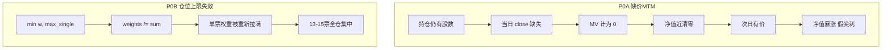
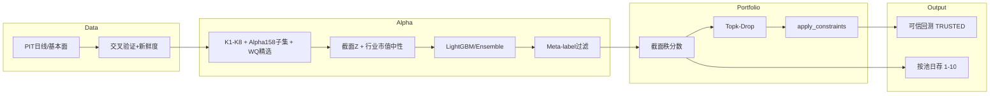

# Nous V2：回测可信度 + 开源范式蒸馏优化方案

## 一、诊断结论（引擎层，已与代码对齐）

净值「100万→6.5万→173万」的主因是**净值序列被污染**后出现 -95% / +2342% 尖刺；Sharpe/Sortino 被尖刺后的正收益段拉高，形成「灾难回撤 + 虚高夏普」。

| 问题 | 代码证据 | 用户现象 |
|------|----------|----------|
| 缺价当日仓位按 0 计价 | [`engine.py`](src/nous/engine/backtest/engine.py) MTM | 单日 -95% 再 +2342% |
| `max_single_weight` 先裁后全量归一 | `_build_portfolio` | 配置 12% 可被抹掉 |
| HRP/max_sharpe 未接线 | `else`→equal_weight；[`optimizer.py`](src/nous/engine/portfolio/optimizer.py) 零引用 | 海鹰F3 `hrp` 名存实亡 |
| 港股全员 7.0 | [`daily_recommendation_pipeline.py`](src/nous/engine/pipelines/daily_recommendation_pipeline.py) `i>=20→7.0` | 黄牌 1 |
| 交叉验证未进门禁 | `cross_validate_close` 有库无闸 | 黄牌 2/3 |

**仓位约定：** 回测以 `PortfolioSpec.max_single_weight` 为准（F3=0.12）；`trading.max_position_pct: 0.30` 为硬安全天花板 `min(strategy_cap, 0.30)`。

**原则：** P0 未过门禁前，任何策略收益数字标记不可信；P3 模型升级不得绕过 P0/P1 完整性旗标。

---

## 二、开源生态蒸馏（方法移植，非整库吞并）

对口碑成熟、可复现的开源体系做「可执行蒸馏」——**吸收其经过验证的工作流与组件语义，不把 Nous 改造成 Qlib/vnpy 壳子**。

### 2.1 对标矩阵

| 开源体系 | 口碑定位 | 蒸馏什么进 Nous | 明确不引进 |
|----------|----------|---------------------|------------|
| **Microsoft Qlib**（~39k★） | A 股 ML 选股研究事实标准：Alpha158/360 + LightGBM 基线 + TopkDropout | 截面标准化(CSZScore)、处理器链、**Topk-Drop 换仓**、IC/RankIC/ICIR 评估、标签与成交价对齐 | 不整仓依赖 qlib 运行时；不引入 Alpha360 原始时序张量训练（成本高、与现有树模型路径冲突） |
| **WorldQuant 101 Alphas**（论文 + `alpha101` 实现） | 短持仓公式化 alpha 经典集；低互相关 | 按 IC 筛选 **20–30 个**可算公式作 `K9_wq*`；行业类需 `industry` 字段 | 不盲装全部 101；二进制 alpha 暂跳过 |
| **PyPortfolioOpt**（已在用） | HRP / max-Sharpe / 约束 | 真正接线 + `apply_constraints` 留现金语义 | 不在无稳健协方差时硬跑 max_sharpe |
| **López de Prado 范式**（CPCV/Purge/Meta-label，项目已有半成品） | 防过拟合与置信过滤 | 把已有 `meta_labeling` / purged WF **接到主训练与荐股路径** | 不新开第三套验证框架 |
| **VeighNa / vn.py** | 国内实盘 CTP 全栈 | 仅备选：未来实盘网关；风控单票/板块上限语义已对齐 | 本轮不引入交易网关 |
| **Backtrader**（项目已有 bridge） | 事件驱动教学引擎，维护停滞 | 保持可选对照，不以它为准星 | 不以 BT 替换自研引擎 |
| **TradingAgents / Vibe-Trading** | LLM 多 Agent 叙事热 | 已有 DeepSeek 报告层够用；可借鉴「风控 Agent 否决权」产品形态 | 不引入重型多 Agent 编排依赖 |

### 2.2 Nous 现状 vs 业界基线（模型层缺口）

现有能力（[`engine/ml/`](src/nous/engine/ml/)）：~30 个 K1–K8 因子（注释对标 Alpha158 但远未齐）、LightGBM 主模型 + 六模型 ensemble、gplearn 挖因子、meta-label 可选、规则筛 + ML 加成双轨。

相对 Qlib/成熟私募流水线的关键缺口：

1. **无真正截面处理**：`FactorSpec.neutralization` 声明未落地；缺 CSZScore / 行业·市值中性。
2. **因子厚度不足**：~30 列 vs Alpha158；基本面仅 PE/PB/ROE/MV；K8 多为市场级同值。
3. **标签粗糙**：简单 N 日远期收益，缺截面分位标签；训练标签与回测成交价（close/open/vwap）未强制对齐。
4. **换仓过猛**：全仓清空再等权买入 ≈ 高换手；业界默认 **Topk-Drop**（持有 TopK，每期只换 Drop 只）。
5. **打分多轨未统一**：日荐排名分 / Stage2 merged_score / screener 规则分 / trader scoring — 港股塌陷是症状之一。
6. **评估缺 IC 门禁**：有训练无「上线前 RankIC>阈值」硬闸；回测只看收益不看预测质量。

### 2.3 目标架构（蒸馏后）

---

## 三、Phase P0 — 回测可信度（阻断假净值）

### P0.1 缺价 MTM：禁止「持仓→零」

文件：[`engine.py`](src/nous/engine/backtest/engine.py)

- 无价用 **last_known_price**；记 `stale_price_days`。
- 连续缺价 ≥3 日 → 预警/强制按最近有效价折价处理，**绝不静默计 0**。
- 换仓卖出价缺失：用 last_known 或跳过该标的，禁止 `proceeds=0` 吞仓。

### P0.2 仓位约束：裁剪后不「全额归一」

- 原始权重 → [`apply_constraints`](src/nous/engine/portfolio/optimizer.py)（`n*max_single<1` 时**剩余留现金**）。
- **删除**强制 `weights/=sum`。
- 下单后断言单票权重 ≤ `max_single + ε`（整百股误差约 2%）。

### P0.3 回归夹具

- `test_missing_price_does_not_zero_equity`
- `test_max_single_weight_survives_rebalance`
- `test_apply_constraints_leaves_cash_when_n_times_cap_lt_1`

验收：海鹰F3（2025-11-01→2026-07-10）**无单日 |r|>50% 尖刺**。

---

## 四、Phase P1 — 优化器接线 + 指标审计

### P1.1 HRP / max_sharpe

- 接 `optimize_hrp` / `optimize_max_sharpe`；失败回退 equal_weight + warning。
- **优化结果必须再过 `apply_constraints`**。
- `risk_parity`：用 HRP 近似，禁止空 `else`。

### P1.2 日收益 / Sharpe / Sortino

[`metrics.py`](src/nous/engine/backtest/metrics.py)：分母保护、同日 equity 去重、统一 rf、`sharpe_winsorized`、尖刺计数、`integrity_flags.TRUSTED`。

### P1.3 门禁

`TRUSTED==true` ∧ 单票权重合规 ∧ Sharpe 与去尖刺 Sharpe 相对偏差 <30%。

---

## 五、Phase P2 — 荐股黄牌

### P2.1 港股评分

- **按池独立**排名打分，或落库 Stage2 `merged_score`→1–10；删除 `i>=20→7.0`。
- 展示分与 **ML 截面秩**对齐（见 P3.3），避免再发明第三套分数。

### P2.2–P2.3 数据门禁

- 日线滞后 >1 交易日 → 拒绝短线池写入。
- `cross_validate_close`：>5% 剔除；2–5% 降权打标。
- 修复 validators cron 与库函数不一致；异常股进 quarantine（TTL 5 日）。

---

## 六、Phase P3 — 开源范式落地（因子 × 模型 × 组合）

### P3.1 截面处理 + IC 门禁（对标 Qlib DataHandler processors）

落点：[`factor_compute.py`](src/nous/engine/ml/factor_compute.py)、训练入口 [`model_train.py`](src/nous/engine/ml/model_train.py)

- 实现 **按 trade_date 的 CSZScoreNorm**（截面去极值 winsorize → zscore）。
- 落地已声明的 **行业 / 市值中性化**（回归残差或分组 demean）；无行业映射时至少做市值中性并打 `partial_neutral` 旗标。
- 训练与周更后强制输出：**IC、RankIC、ICIR**（滚动 20 日）；RankIC 低于阈值（建议 A 股 0.02）→ 模型不晋升、日荐降级为规则轨。
- 标签：默认 `fwd_ret_N` 改为可选 **截面分位标签**（Qlib 风格排序目标更贴合选股）；并文档化「标签收益定义 ↔ 回测成交价」一致性（close 训则 close 成交，或统一 next_open）。

### P3.2 因子库扩容（对标 Alpha158 子集 + Alpha101 精选）

- **不整包依赖 qlib**：在 `factor_compute` 内移植 Alpha158 中与现有 K 互补的高复用表达式（价格相对位置、多窗波动、量价相关、高开低收衍生等），目标将有效特征从 ~30 扩到 **80–120**。
- **Alpha101**：用开源实现或自研公式，批量算 IC，保留 RankIC 稳定且与 K 因子相关 <0.7 的 **20–30 个** 为 `K9_wqXX`；需 `vwap`/`industry` 的先补数据字段。
- K8 另类数据：改为 **标的级**（个股北向/融资余额）优先于全市场同值，避免伪特征。
- 遗传挖因子（已有 gplearn）保留为探索轨，晋升须过同一 IC 门禁。

### P3.3 Topk-Drop 换仓 + 打分统一（对标 Qlib TopkDropoutStrategy）

落点：[`engine.py`](src/nous/engine/backtest/engine.py) `_simulate`、日荐 pipeline

- 将「每期全清仓再买入」改为：**持仓目标 = 预测分 TopK；每期最多卖出 Drop 只最差持仓，买入同等数量未持仓最优**；换手 ≈ `2*Drop/K`，并真正消费 `PortfolioSpec.turnover_limit`。
- 海鹰F3 建议默认：`K=max_positions(15)`，`Drop=3`（可配置）。
- **单一排序源**：回测 `_rank_stocks` 与日荐 Stage2 共用同一 `predict` 截面秩；展示分 = 池内秩映射到 9.0–7.0，消灭硬编码 7.0 天花板。
- Meta-label（已有模块）：预测置信度低于阈值则当日不新开/缩小 Drop，接入主路径而非可选实验。

### P3.4 明确延后（本轮不做）

- 引入 Transformer/LSTM/HIST 等深度模型（Qlib 模型动物园）——树模型 + 厚因子 + 可信回测 ROI 更高。
- 整仓接入 Qlib `qrun` / RD-Agent 自动挖因子。
- vnpy 实盘网关、市场中性期货对冲完整实现。

---

## 七、落地顺序与工时

| 顺序 | 交付物 | 预估 |
|------|--------|------|
| 1 | P0 缺价 MTM + 仓位约束 + 测试 + 重跑 F3 | 1–2 天 |
| 2 | P1 优化器接线 + metrics TRUSTED | 1 天 |
| 3 | P2 按池打分 + 交叉验证门禁 | 1–2 天 |
| 4 | P3.1 截面中性 + IC 门禁 | 2 天 |
| 5 | P3.2 Alpha158 子集 + WQ 精选 | 2–3 天 |
| 6 | P3.3 Topk-Drop + 打分统一 + 再跑 F3/对比 | 1–2 天 |

关键文件：

- [`src/nous/engine/backtest/engine.py`](src/nous/engine/backtest/engine.py)
- [`src/nous/engine/backtest/metrics.py`](src/nous/engine/backtest/metrics.py)
- [`src/nous/engine/portfolio/optimizer.py`](src/nous/engine/portfolio/optimizer.py)
- [`src/nous/engine/ml/factor_compute.py`](src/nous/engine/ml/factor_compute.py)
- [`src/nous/engine/ml/model_train.py`](src/nous/engine/ml/model_train.py)
- [`src/nous/engine/ml/predict.py`](src/nous/engine/ml/predict.py)
- [`src/nous/engine/ml/meta_labeling.py`](src/nous/engine/ml/meta_labeling.py)
- [`src/nous/engine/pipelines/daily_recommendation_pipeline.py`](src/nous/engine/pipelines/daily_recommendation_pipeline.py)
- [`src/nous/data/quality/validators.py`](src/nous/data/quality/validators.py)
- 新增 `tests/engine/backtest/test_position_and_mtm.py`、`tests/engine/ml/test_cs_norm_ic.py`

---

## 八、成功标准

1. **可信回测**：F3 同期无清零式跳变；单票权重合规；报告 `TRUSTED=true`。
2. **可区分荐股**：港股 Top 得分非常数；短线池无交叉验证 error 级标的。
3. **可度量 alpha**：晋升模型 RankIC/ICIR 过门禁；Topk-Drop 后换手下降且 OOS 收益不依赖尖刺；同一预测秩驱动回测与日荐。
