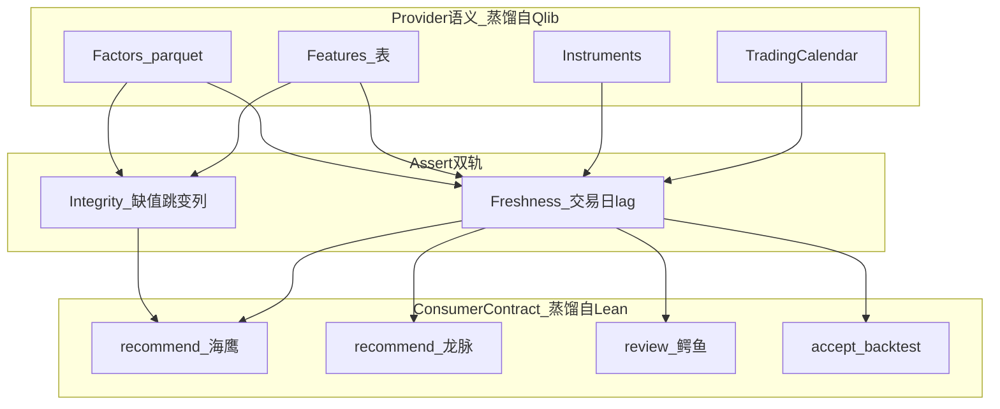

# 数据鲜度全链路计划

## 设计原则（与 V2 回测方案一致）

**方法移植，非整库吞并**：吸收顶尖开源的工作流与组件语义，不把 Nous 改造成 Qlib/Lean/vnpy 壳子。本项目已有 [`validators`](src/nous/data/quality/validators.py) / [`gap_detector`](src/nous/data/quality/gap_detector.py) / [`quarantine`](src/nous/data/quality/quarantine.py) / PIT [`data_handler`](src/nous/engine/backtest/data_handler.py) — 在其上对齐业界契约。

---

## 开源生态蒸馏（数据层）

| 开源体系 | 口碑定位 | 蒸馏进鲜度方案 | 明确不引进 |
|----------|----------|----------------|------------|
| **Microsoft Qlib** | A 股研究数据层事实标准；`CalendarProvider` + `check_data_health.py` | **交易日历优先**算 lag；健康检查=缺值/大跳变/必备列/factor 列；收盘后定时更新 raw→特征 | 不依赖 `~/.qlib` bin 格式与 qrun |
| **Zipline Reloaded** | 美股 bundle + exchange_calendars | **Bundle/ingest 语义**：数据按「包」版本化；日历与资产元数据绑定 | 不换整套 Zipline pipeline |
| **QuantConnect Lean** | 机构级多资产回测 | **Subscription/Consumer Contract**：每个策略声明所需分辨率与数据集；缺数则拒订阅 | 不引入 Lean 运行时 |
| **RQAlpha / RiceQuant 系** | 国内券商友好回测 | A/HK **休市日历**与分钟/日频分层 | 不绑 RiceQuant 云 |
| **Alphalens** | 因子研究事实标准 | 因子日期必须与价格日历对齐；IC 失效=数据/因子双红灯 | 不整包依赖 alphalens |
| **López de Prado**（项目已有 purge/WF） | 防标签泄漏 | 鲜度断言与 **embargo** 一致：训练/荐股不得用未落地的「当日未收盘」特征 | 不新开第三套验证框架 |
| **VeighNa / vn.py** | 国内实盘 | 行情网关「断流/延迟」语义 → 映射为 T0 分钟线 stale 旗标 | 本轮不接 CTP |

### 从开源提炼的六条可执行契约

1. **Calendar-first（Qlib/Zipline）**  
   一切 `max_lag_days` = **交易日**，不是自然日−周末。统一 [`trading_calendar`](src/nous/engine/indicators/gate.py)（抽公共模块），A 15:00 / HK 16:10 收盘点与现有 `gate.py` 对齐。

2. **Provider 三层（Qlib）**  
   逻辑拆分（可用函数/模块，不必类继承）：
   - Calendar → Instruments（`stock_basic`/universe）→ Features（日线/资金/宏观）→ Factors（parquet）
   - assert 按层报错，避免「表有行但日历对不齐」假绿。

3. **Health ≠ Freshness（Qlib check_data_health）**  
   `nous data assert` 双轨：
   - **Freshness**：相对上一交易日的 lag / coverage / 文件 mtime
   - **Integrity**：OHLCV 缺列、单日涨跌幅跃迁阈值、factor 快照必备列、空表
   - 现有 `validators.validate_daily_bar` / 交叉验证保留为 Integrity 子集。

4. **Versioned factor bundle（Zipline bundle + Qlib 快照）**  
   除 `latest.parquet` 外，强制保留 `factors/snapshots/YYYY-MM-DD.parquet`；assert 检查 **快照交易日 == 日历上一交易日**（或声明的 as_of），禁止只看 mtime 而内容停在更早截面。

5. **Consumer Contract（Lean subscription）**  
   每个消费入口声明 `required_datasets`：
   - 海鹰F3 recommend：`stock_daily(A)` + `fundamental` + `factors/latest` + `models`
   - 龙脉TRL：`theme_auto_pools(today)` + `stock_daily` + industry
   - crocodile review：`index_daily` + `margin` + `hsgt` + `futures_basis`
   - backtest accept：历史 PIT 完备 + 因子可用或显式 `FALLBACK_MOMENTUM`
   - assert `--consumer recommend|trl|review|backtest|all` 只验相关子集

6. **Update-then-Assert-then-Consume（Qlib cron 习惯）**  
   采集完成 → health/assert → 才允许 screen/recommend；禁止与 ETL 并行写读同一日截面。



---

## 现状结论（本项目）

系统已有多层检查，但**不成体系**：

- CLI：[`nous data status|health|freshness`](src/nous/cli.py) — freshness 只着色，不裁决
- SLA：[`gap_detector.py`](src/nous/data/quality/gap_detector.py) 仅 3 表
- 消费门禁：荐股 `lag>1` 拦短池；筛选 80% 覆盖；回测 PIT **不拦最新鲜度**；因子缺失会 **静默** momentum fallback
- 双调度重叠；若干 health job last=error；因子/模型无日级 SLA
- 相对 Qlib：缺统一 CalendarProvider、缺 `check_data_health` 级完整性脚本、因子无版本化 as_of

---

## 一、数据域清单与分级 SLA（单一事实源）

新增 [`src/nous/data/quality/sla_registry.py`](src/nous/data/quality/sla_registry.py) + [`trading_calendar.py`](src/nous/data/quality/trading_calendar.py)；`gap_detector` / CLI / assert / 报告全部读它。

| 级别 | 含义 | 失败动作 |
|------|------|----------|
| **P0** | 阻断荐股/筛选/交易 | `nous data assert` exit 1；pipeline `ready=False` |
| **P1** | 阻断短池/降级 ML | 跳过短池或 coarse-only + `DEGRADED` 标记 |
| **P2** | 可降级信号 | 鳄鱼派中性分；报告标黄 |
| **P3** | 周更/归档 | 仅周报 |

### 域 → 资产 → SLA（**交易日**滞后）

**B 微观（P0）** — Qlib Features 层
- `stock_daily`（A）：max_lag=1，coverage≥80%；Integrity：OHLCV 齐、单日 |r| 跃迁阈值（复用 validators）
- `stock_daily`（HK）：max_lag=1，coverage≥70%
- `stock_basic`：universe>0

**B 基本面（P1）**
- `stock_fundamental`：max_lag=2，PE 覆盖≥60%（统一掉 CLI 里 5d 冲突）

**A 宏观（P1–P2）**
- `index_daily`：max_lag=1（P1）
- `index_global_daily`：max_lag=2（P2）
- `futures_daily` / `futures_basis`：max_lag=1（P2）
- `sentiment_cache`：max_lag=1（P2）
- macro_*：发布频率，>35 自然日告警（P3）

**C 资金（P1–P2）**
- `hsgt_market_daily`：max_lag=1（P1）
- `hsgt_stock_daily`：max_lag=3（P1）
- `fund_flow_stock` / `margin_daily` / `etf_flow_daily` / `block_trades`：max_lag=2（P2）

**D 龙虎榜（P2）**
- `lhb_daily`：max_lag=2

**E 因子/模型（P0–P1）** — Zipline bundle + Alphalens 对齐
- `factors/snapshots/{last_trade_date}.parquet` 存在且行数≥500（P0 荐股）
- `latest.parquet` 的 as_of 与快照一致（防 mtime 造假绿）
- `models/lgb_*.pkl`：mtime≤14 自然日或按交易日≤10（P1）；缺失→`DEGRADED` 禁止静默当满分 ML
- RankIC 连续失效 → P1（复用 `retrain_trigger`）

**F 荐股产物（P0）**
- `screen_results` / `theme_auto_pools(today)` / 收盘后 `recommendation_pool`

**G 回测 accept**
- 历史洞检测 + 因子可用或显式 `FALLBACK_MOMENTUM`（禁止静默）

---

## 二、命令面

```bash
nous data freshness              # 读 SLA 着色
nous data assert                 # Freshness+Integrity；P0→exit 1
nous data assert --domain capital|macro|factor|all
nous data assert --consumer recommend|trl|review|backtest
nous data health                 # 对齐 registry
```

对标 Qlib：`python scripts/check_data_health.py` → 本仓 `nous data assert`（中文报告 + JSON）。

落点：扩展 gap_detector；health_dashboard 写 `docs/data/freshness/<date>/`；pipeline readiness 硬拒跑；accept 挂 assert。

---

## 三、生产节奏（Update → Assert → Consume）

| 时间 | 动作 | 对标 |
|------|------|------|
| 16:30–16:45 | ETL | Qlib 收盘更新 raw |
| 16:44 | cross-validate | Integrity 外源对照 |
| 16:50 | `data assert` | Qlib check_data_health |
| 16:55 | post-update-verify(afternoon) | 二次确认 |
| assert 通过后 | daily-recommend / screen | 禁止与 ETL 并行 |
| 17:10 | factor 增量或鲜度闸 | bundle 日更 |
| 次日 08:30 / 09:30 | assert-am / preflight | 开盘门禁 |
| 周日 02:00 | weekly-train | 全量模型 |

---

## 四、基础设施债

1. 统一冲突阈值到 registry  
2. 修 `post-update-verify`；补齐或下线缺失 integrity/cleanup  
3. 调度 health_dashboard + daily_quality_report  
4. Hermes 重复 health → 转调 `nous data assert`  
5. `screen_results.screen_date` 列名一致  
6. auto_backfill → `nous data update`  
7. 因子 dated snapshot 写入路径（`factor_compute save`）

---

## 五、交付物

1. `sla_registry.py` + `trading_calendar.py` + ConsumerContract  
2. `nous data assert`（鲜度+完整性）+ 中文报告  
3. recommend/accept 硬门禁；因子禁止静默 fallback  
4. [`docs/data/FRESHNESS.md`](docs/data/FRESHNESS.md)（含开源对标矩阵与依赖表）  
5. 首轮 assert 缺失 backlog  

存档：实施前将本计划同步到 `docs/superpowers/specs/2026-07-17-data-freshness-design.md`（与回测 V2 方案同目录）。

---

## 六、实施顺序

1. Calendar + Registry + ConsumerContract（先契约）  
2. assert CLI（鲜度+完整性子集）+ 基线红灯清单  
3. 修 cron + 报告落盘  
4. 消费硬挂 + 因子版本化/日鲜度  
5. 按红灯补采集  

默认不做：整仓接入 Qlib/Lean；一次性重写 Hermes 112 job。