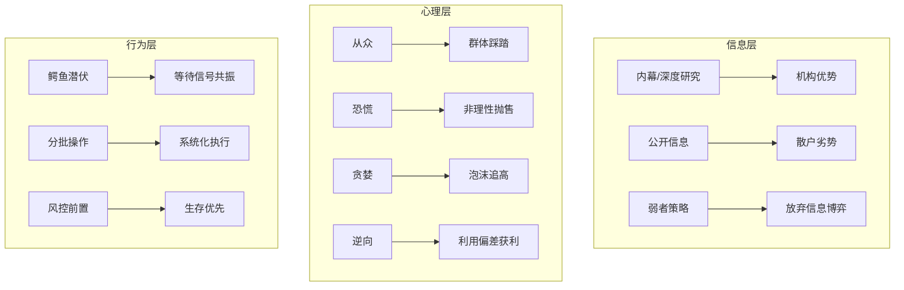

# 股市心理博弈 — 群体心理与行为偏差

> 核心命题：股市不仅是经济的晴雨表，更是**群体心理的投射场**。每一笔成交的背后，是两种心理预期在博弈；每一条K线背后，是一群人的恐惧与贪婪在角力。

---

## 一、核心思想框架

### 1.1 股市博弈的三层结构

| 层级 | 内容 | 主导因素 |
|------|------|---------|
| **信息层** | 谁拥有更多、更准确的信息？ | 信息不对称 |
| **心理层** | 谁能在恐惧/贪婪中保持理性？ | 情绪控制 |
| **行为层** | 谁在利用他人的行为偏差获利？ | 逆向博弈 |

**核心洞察：** 股市博弈的最终赢家，往往是那个**最懂"别人的错误"**的人，而非拥有最多信息的人。

### 1.2 心理博弈的零和本质

- 每一笔交易都是**预期相反的博弈**：卖方认为要跌，买方认为要涨
- 双方同时看信息，但各自的心理滤镜不同 → 得出相反的结论
- 赢家不是预测最准的人，而是**心理最稳的人**（与[[交易心理分析-马克道格拉斯-蒸馏]] 一致）

> 你赚的每一分钱，都来自某个对手的认知/心理偏差。

---

## 二、群体心理在股市中的表现

### 2.1 从众效应（Herding）

**定义：** 个体放弃独立思考，追随群体的决策行为。在股市中表现为"别人买我也买，别人卖我也卖"。

**驱动机制：**
- 社会认同本能：群体决策 = 安全决策（进化遗留——被群体排斥有生存风险）
- 信息瀑布：看到别人买 → 认为他们有内幕消息 → 跟着买 → 更多人跟着买
- 卸责心理：错了可以怪"大家都这么看"

**股市现象：**
| 指标 | 从众信号 |
|------|---------|
| 成交量 | 突然放大说明散户跟风涌入 |
| 媒体热度 | 全民讨论某只股票时往往是顶部 |
| 分析师一致性 | 80%+分析师看多 → 市场已充分定价 |
| 社交平台 | 晒单/推荐/情绪词频率激增 → 群体情绪极致 |

**可量化检测：**
```python
def herding_index(market):
    """从众程度指数"""
    turnover_ratio = market.turnover / market.avg_turnover_20d  # 换手率倍数
    media_heat = market.media_mentions / market.avg_mentions_30d  # 媒体热度
    analyst_consensus = market.bull_ratio  # 分析师看多比例
    retail_margin = market.retail_margin_growth / market.market_cap  # 散户杠杆
    
    score = (turnover_ratio * 0.3 + media_heat * 0.25 + 
             analyst_consensus * 0.25 + retail_margin * 0.2)
    return score
    # > 2.0 → 极度从众 → 警惕反转
```

### 2.2 恐慌（Panic）

**定义：** 在不确定性和下跌中，群体情绪从担忧升级为恐惧，触发非理性抛售。

**心理阶段演化：**
```
怀疑 → 担心 → 恐惧 → 恐慌抛售 → 踩踏
（跌5%） （跌15%） （跌30%） （跌40%+）
个体理性  半群体   全群体   机械化无差异抛售
```

**恐慌的特征：**
- 价格与基本面脱钩——好公司也被大甩卖
- 成交量急剧放大后持续萎缩（卖无可卖）
- 杠杆资金被强制平仓，形成"下跌→强平→再下跌"的负反馈
- 媒体充斥"末日论"（此即霍华德·马克斯的[[周期-霍华德马克斯-蒸馏]] 情绪钟摆最极端位置）

**鳄鱼派关联：** 恐慌期 = 鳄鱼潜伏期的最佳出击窗口（见第六节）

### 2.3 贪婪（Greed）

**定义：** 在连续上涨中，群体从乐观升级为亢奋，忽视风险，追高买入。

**心理阶段演化：**
```
关注 → 羡慕 → 冲动 → 追高 → 疯狂加杠杆
（涨10%） （涨30%） （涨50%） （涨80%） （涨100%+）
```

**贪婪的特征：**
- 估值严重脱离历史区间——"这次不一样"
- 新投资者大量涌入（开户数激增）
- 融资余额/杠杆率创历史新高
- 亲友推荐、社交媒体晒单成风
- 基本面利空被忽视或"重新解释"为利好

**可量化检测：**
```python
def greed_panic_index(market):
    """贪婪/恐慌指数（0极度恐慌 ~ 100极度贪婪）"""
    pe_pct = market.pe_percentile_5y  # PE在5年中的分位数
    margin_pct = margin_balance_percentile(market)  # 融资余额分位
    new_accounts_pct = new_accounts_percentile(market)  # 新开户分位
    volume_pct = volume_percentile(market)  # 成交量分位
    
    index = (pe_pct * 0.3 + margin_pct * 0.25 + 
             new_accounts_pct * 0.2 + volume_pct * 0.25)
    return index * 100
    # 0-20: 极度恐慌（买入区间）
    # 80-100: 极度贪婪（卖出区间）
```

---

## 三、信息不对称下的博弈行为

### 3.1 信息分层：市场的"食物链"

```
顶级机构（PE/VC/产业资本） ──── 最内圈：直接参与公司经营
   ↓ 信息差距 3-6个月
大型机构（公募/社保/险资） ──── 企业调研、管理层沟通
   ↓ 信息差距 1-3个月
中型机构（私募/游资） ──────── 研究深但时间滞后
   ↓ 信息差距 1-4周
大户/专业散户 ────────────── 公开信息+技术分析
   ↓ 信息差距 即时
普通散户 ────────────────── 新闻/谣言/社交媒体
```

### 3.2 信息不对称下的三类博弈

#### 博弈A：机构 vs 机构（零和中的非零和）
- 比的是研究深度和速度
- 同样看到同一份财报，谁能更快更准地解读？
- 胜负差距往往在**边际信息处理能力**

#### 博弈B：机构 vs 散户（最佳捕食场景）
- 机构利用信息优势和技术优势，利用散户的从众/恐惧/贪婪获利
- **典型套路：** 机构建仓（静默期）→ 释放利好/媒体造势 → 散户追高 → 机构出货 → 散户被套

#### 博弈C：散户 vs 散户（互相踩踏）
- 在信息不足的情况下，靠"猜别人的心理"来决策
- 形成"多重猜测"的连锁反应（凯恩斯选美理论）
- 最终胜出者往往是**逆向思维**最强的那个

### 3.3 冯柳弱者体系的解法

冯柳的[[冯柳-弱者体系-蒸馏]] 正是针对信息不对称的最优策略：

> "我承认自己永远无法获得与机构对等的信息，所以我放弃在信息层面博弈。我的优势是**赔率思维**——只要我买得足够便宜，即使无人知道真相，我也能安全退出。"

**弱者博弈三原则：**
1. **不猜内幕** — 放弃信息优势幻想，只用公开信息
2. **不赌方向** — 不预测别人会怎么做，只判断"当前位置是否有安全边际"
3. **赔率优先** — 下跌空间有限（20%），上涨空间较大（50%+）时才出手

---

## 四、散户 vs 机构的心理差异

### 4.1 五大核心差异

| 维度 | 散户心理 | 机构心理 | 博弈后果 |
|------|---------|---------|---------|
| **时间视野** | 短期（天~周）— 急于获利 | 中长期（季~年）— 允许等待 | 散户割肉时机构接筹 |
| **风险感知** | 损失厌恶：跌10%就极度焦虑 | 回撤容忍：允许20%+的账面亏损 | 散户恐慌抛售=机构建仓机会 |
| **决策依据** | 社交影响/新闻/群聊 | 数据模型/基本面/风控框架 | 机构利用消息差出货/建仓 |
| **仓位管理** | 满仓进出，情绪化加减 | 分批建仓，系统化风控 | 散户满仓追涨后被套 |
| **信息处理** | 近因偏误：最近消息权重过大 | 逆向思维：极端情绪时反向思考 | 媒体情绪到达极致时反转 |

### 4.2 散户的典型心理陷阱

| 陷阱 | 表现 | 根源 |
|------|------|------|
| **追涨杀跌** | 涨了才信，跌了就慌 | 确认偏误+损失厌恶叠加 |
| **成本锚定** | 被买入价锚住，不愿止损 | 沉没成本谬误 |
| **过度交易** | 频繁操作，手续费侵蚀利润 | 行动偏误+"不做点啥就难受" |
| **处置效应** | 赚小钱就跑，亏了死扛 | 过早兑现盈利/延迟承认亏损 |
| **羊群效应** | 看到别人赚就跟风 | 社会认同本能+害怕错过(FOMO) |
| **本地偏误** | 只买自己熟悉/本地/热门的票 | 可得性启发式 |
| **后见之明** | 事后觉得自己早就看对了 | 记忆重构 + 自利归因 |
| **赌徒谬误** | 连续下跌后觉得"该涨了" | 误解概率独立性 |

### 4.3 机构的优势是系统化的心理控制

机构不是没有心理偏差，而是**通过系统将其最小化**：
- 投决会制度：一人一票，决策不依赖个人
- 风控前置：买入前定好止损/止盈条件
- 复盘机制：定期复盘决策流程而非结果（对抗结果偏误）
- 检查清单：交易前强制通过检查清单（参见[[芒格-多元思维误判心理-蒸馏]]）

---

## 五、如何利用群体心理逆向操作

### 5.1 逆向操作的核心逻辑

> **"别人贪婪时我恐惧，别人恐惧时我贪婪。"
> 但关键在于：如何定义"别人贪婪"和"别人恐惧"？**

### 5.2 可量化的逆向信号系统

#### 信号组A：极度恐慌（买入窗口）

```
必须同时满足 ≥4个条件：
┌─────────────────────────────────────────────┐
│ ☐ 贪婪恐慌指数 < 20                        │
│ ☐ PE/PB处于5年最低10%分位                  │
│ ☐ 成交量萎缩至1年最低30%以内               │
│ ☐ 融资余额创1年新低或持续下降>30%           │
│ ☐ 媒体情绪：负面报道占比>60%                │
│ ☐ 散户开户数创半年新低                      │
│ ☐ 巴菲特指标（总市值/GDP）< 50%             │
│ ☐ 新基金发行募资创1年新低                  │
└─────────────────────────────────────────────┘
```

#### 信号组B：极度贪婪（卖出/减仓窗口）

```
必须同时满足 ≥4个条件：
┌─────────────────────────────────────────────┐
│ ☐ 贪婪恐慌指数 > 80                        │
│ ☐ PE/PB处于5年最高10%分位                  │
│ ☐ 成交量放大至1年均值2倍以上                │
│ ☐ 融资余额创1年新高或持续增长>50%           │
│ ☐ 媒体情绪：正面报道占比>60%                │
│ ☐ 散户开户数创半年新高                      │
│ ☐ 巴菲特指标（总市值/GDP）> 100%            │
│ ☐ 亲友开始给你推荐股票                      │
└─────────────────────────────────────────────┘
```

### 5.3 赵军淡水泉的逆向三层确认

借鉴[[赵军-淡水泉逆向投资-蒸馏]] 的方法论：

1. **市场情绪极端** — 信号组A或B触发
2. **基本面未恶化** — 行业趋势、公司竞争力、财务指标正常
3. **价格已反映悲观** — 估值低位、回撤充分

> 三层都满足再出手，单向情绪指标不可靠。

### 5.4 索罗斯反身性的逆向时机

借鉴[[索罗斯-反身性宏观择时-蒸馏]]：

- **上行反身性极致（泡沫）**：价格上涨→基本面改善→价格继续涨→基本面过度膨胀→不可持续 === **卖出窗口**
- **下行反身性极致（恐慌）**：价格下跌→基本面恶化→价格继续跌→基本面过度悲观→不可持续 === **买入窗口**

索罗斯的独特之处：他**不是赌方向，而是赌趋势的不可持续性**。当群体心理把趋势推到极端时，必然逆转。

### 5.5 逆向执行中的心理挑战

即使知道 "应该逆向操作"，实际执行时最难的点：

| 逆向动作 | 心理阻力 | 应对策略 |
|---------|---------|---------|
| 恐慌时买入 | 恐惧继续下跌的痛 | 分批建仓+只买前就定好极限跌幅 |
| 贪婪时卖出 | 害怕踏空继续涨的悔 | 分批减仓+用移动止盈保护已有利润 |
| 别人都赚钱时不动 | FOMO焦虑 | 建立"每笔交易独立"的概率思维 |
| 持有冷门股 | 孤独感/怀疑自己 | 用检查清单确认当初买入理由仍在 |

---

## 六、与鳄鱼派「潜伏期」心态管理的关联

### 6.1 群体心理是鳄鱼捕食的背景板

鳄鱼派的交易哲学根植于对群体心理的深刻理解：

```
鳄鱼潜伏 → 等待猎物进入攻击范围 → 瞬间出击
   ↓              ↓                      ↓
散户群体   群体心理走向极端       情绪钟摆到位
制造波动    (恐慌或贪婪极致)      逆向操作一击必中
```

### 6.2 潜伏期需要克服的群体心理压力

鳄鱼派要求"绝大多数时间空仓或轻仓观察"，这在心理上极度反人性：

| 群体心理压力 | 鳄鱼派应对 | 心理学机制 |
|-------------|-----------|-----------|
| 别人都在赚钱，我不动 = 损失感 | "市场永远有机会，这是我选择等的" | 转换框架：从"错过"→"选择等待" |
| 空仓时看到大涨，后悔焦虑 | "不在我的模式内就不做" | 用系统规则对抗情绪冲动 |
| 轻仓时小幅亏损，怀疑体系 | "这是潜伏的成本" | 预期管理：接受不确定性是系统的一部分 |
| 等待太久，失去耐心 | "鳄鱼可以等一个月才吃一次" | 引用生物隐喻强化信念 |
| 做多信号出但没涨，怀疑判断 | "信号共振还不够，继续等" | 用客观条件代替主观判断 |

### 6.3 潜伏期心态管理的核心原则

**原则1：将"等待"重新定义**
- 不是"什么都不做"的空白期
- 而是"主动观察群体心理波动"的活跃期
- 每天问自己：今天群体在恐惧还是贪婪？情绪钟摆在哪个位置？

**原则2：与群体心理保持"观察者距离"**
- 当群体恐慌时，不恐慌——但认真观察恐慌的强度
- 当群体贪婪时，不贪婪——但认真记录贪婪的非理性程度
- 像科学家观察标本一样观察市场情绪

**原则3：用系统取代意志力**
- 不要用"我要忍住不买"——这消耗意志力
- 而是用"条件A/B/C未满足，按规则不操作"——这是系统决策
- 参考[[交易心理分析-马克道格拉斯-蒸馏]] 的核心：交易问题的根源不在市场，在思想结构

### 6.4 潜伏期的可量化纪律

```python
def crocodile_latency_check(market):
    """鳄鱼潜伏期状态检查"""
    # 1. 情绪钟摆位置（霍华德·马克斯）
    pendulum = greed_panic_index(market)
    
    # 2. 信号共振度（多重条件）
    signal_score = 0
    if pendulum < 20: signal_score += 2  # 恐慌→买入候选
    if pendulum > 80: signal_score += 2  # 贪婪→卖出候选
    if market.pe_percentile_5y < 0.15: signal_score += 1
    if market.turnover / market.avg_turnover_20d < 0.6: signal_score += 1
    if market.margin_growth_1y < -0.3: signal_score += 1
    
    # 3. 潜伏状态决策
    if signal_score >= 4:
        return "准备出击 — 多个条件共振"
    elif signal_score >= 2:
        return "继续潜伏 — 部分条件满足，继续观察"
    else:
        return "保持空仓/轻仓 — 信号不明确"
```

### 6.5 鳄鱼派与逆向投资的无缝衔接

将赵军的三层确认与鳄鱼派的潜伏信号合并：

```
鳄鱼潜伏期
  └── 观察群体情绪 + 技术面信号
       └── 情绪信号组触发（赵军第一层）
            └── 基本面确认（赵军第二层）
                 └── 估值确认（赵军第三层）
                      └── 鳄鱼出击（重仓）
                           └── 设置止损/最大回撤防线
                                └── 等待情绪修复+业绩兑现
```

---

## 七、情绪钟摆：霍华德·马克斯的整合框架

### 7.1 情绪钟摆与群体心理的对应

| 钟摆位置 | 群体心理状态 | 操作信号 | 反转概率 |
|---------|------------|---------|---------|
| 极度恐惧（-100） | 恐慌抛售，无人敢买 | 重仓买入 | 极高 |
| 恐惧（-50） | 担忧观望 | 逐步建仓 | 高 |
| 中性（0） | 理性评估 | 持有/观望 | 低 |
| 乐观（+50） | 信心增强，加仓 | 逐步减仓 | 高 |
| 极度乐观（+100） | 贪婪亢奋，全场疯狂 | 清仓卖出 | 极高 |

### 7.2 情绪钟摆的三条规律

1. **不走直线必走曲线** — 情绪不会静止，永远在恐惧和乐观之间摆动
2. **不会相同只会相似** — 每次恐慌的原因不同，但模式相同
3. **少走中间多走极端** — 市场大部分时间处在非理性状态，理性只一晃而过

这三条规律的根源正是**群体心理的不稳定性**。

---

## 八、整合：心理博弈的系统化框架

### 8.1 五步决策链

```
Step 1: 识别群体情绪位置
  └── 贪婪恐慌指数 + 情绪钟摆 + 多重信号组
  
Step 2: 判断信息不对称程度
  └── 我是强者还是弱者？
  └── 冯柳弱者体系：放弃预测，靠赔率
  └── 索罗斯反身性：赌趋势不可持续
  
Step 3: 逆向评估机会质量
  └── 赵军三层确认：情绪极端 + 基本面正常 + 估值到位
  
Step 4: 系统化执行
  └── 鳄鱼潜伏：等待多重信号共振
  └── 分批建仓/减仓：对抗一次性决策的偏见
  
Step 5: 心态管理
  └── 观察者距离：不融入群体情绪
  └── 概率思维：接受每一笔交易的随机性
```

### 8.2 心理博弈的分层对照表



---

## 九、关键训诫

> 1. **你无法战胜市场，但可以利用市场里其他人的错误。**
>
> 2. **逆向下单容易，逆向下单后拿住很难**——最难的不是判断对，而是判断对之后的心理承受力。
>
> 3. **不要试图预测群体行为，只观察群体行为的极端位置。**
>
> 4. **空仓/轻仓本身就是一种仓位管理策略**——它让你在群体犯错时还有子弹。
>
> 5. **最大的风险不是下跌，而是在群体极度恐慌时因为害怕而不敢买入。**
>
> 6. **信息不对称是永远存在的，但情绪不对称是你可以创造的**——当群体极度恐慌时，你保持冷静，这就是你的不对称优势。
>
> 7. **鳄鱼的耐心不是"什么都不做"，而是在做最难的功课——管理自己的心理状态。**

---

## 关联概念

- [[交易心理分析-马克道格拉斯-蒸馏]] — 概率思维与交易心理的根本框架
- [[周期-霍华德马克斯-蒸馏]] — 情绪钟摆与周期的系统分析
- [[冯柳-弱者体系-蒸馏]] — 信息不对称下的赔率优先策略
- [[索罗斯-反身性宏观择时-蒸馏]] — 群体情绪与趋势自我强化的逆转点
- [[赵军-淡水泉逆向投资-蒸馏]] — 逆向操作的三层确认系统
- [[鳄鱼派-核心体系]] — 潜伏期与心态管理的实战体系
- [[芒格-多元思维误判心理-蒸馏]] — 25种误判心理的检查清单

---

*本文基于行为金融学核心理论（Kahneman & Tversky、Thaler）、Le Bon《乌合之众》、以及上述蒸馏概念的整合。原文PDF（53.股市心理博弈.pdf, 389页）文本提取异常，核心内容由跨概念蒸馏与行为金融学框架重构合成。*
